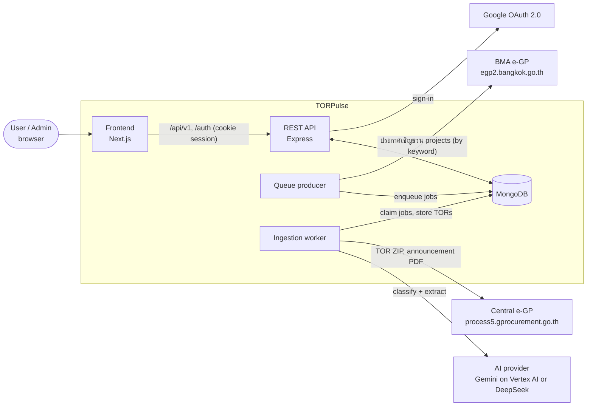
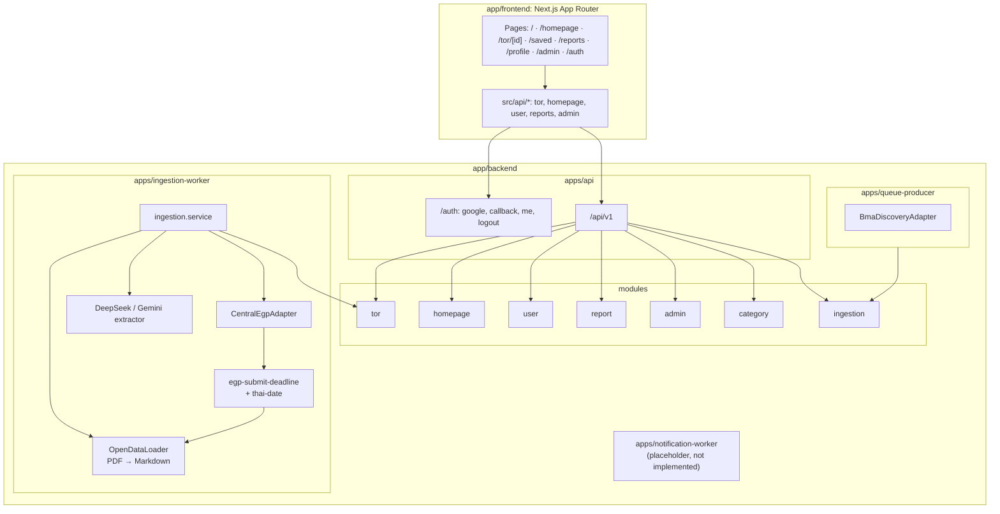
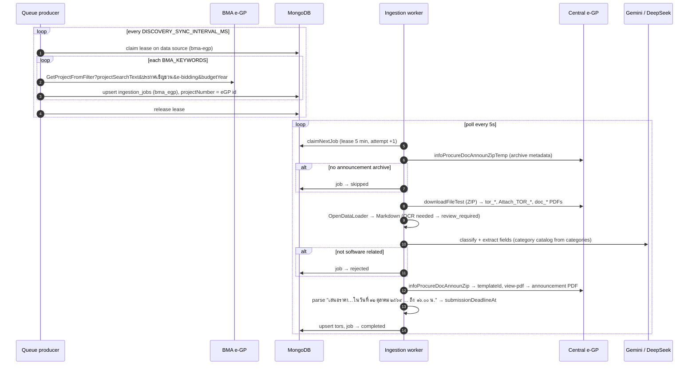
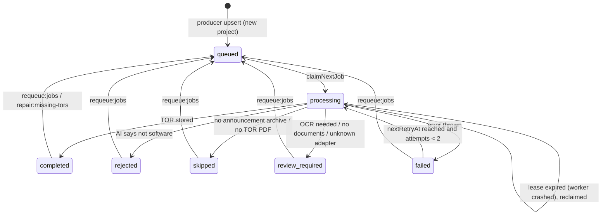
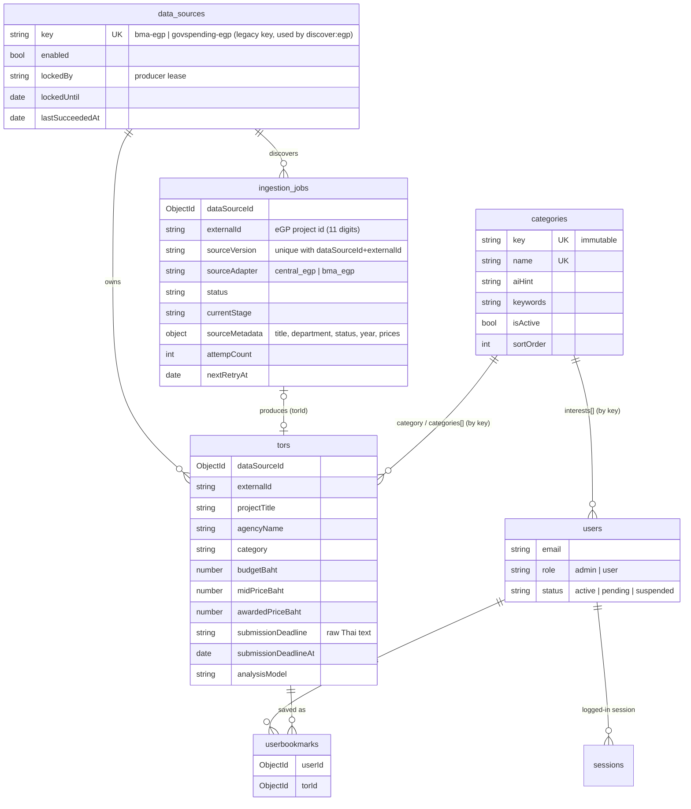

# System architecture

The diagrams below cover all of TORPulse, from the outside systems down to the job lifecycle. They are written in Mermaid, which GitHub renders. For per-field detail of the ingestion pipeline, see `tor-extractor.md`. For how to run each piece, see `commands.md`.

## 1. System context

The three backend processes run separately and share only MongoDB. There is no message broker: the `ingestion_jobs` collection is the queue.

## 2. Containers and modules

## 3. Ingestion pipeline

The deadline read from the announcement PDF takes priority over the LLM's reading; the LLM value is used only when the PDF gives no date. All Central e-GP requests in a process go through a single limiter, spaced 1.2 s apart. HTTP 429 and 5xx responses are retried with backoff.

## 4. Ingestion job lifecycle

Stages inside `processing`: `fetching_details` → `downloading` → `extracting_text` → `classifying` → `extracting_fields` → `storing`.

## 5. Data model

## 6. Discovery sources

| Source | Data source key | Job `sourceAdapter` | What it finds | Auth |
|---|---|---|---|---|
| BMA e-GP | `bma-egp` | `bma_egp` | Bangkok ประกาศเชิญชวน e-bidding projects (still open for bids), matched by keyword and budget year | none |
| eGP announcement search (manual `discover:egp`) | `govspending-egp` | `central_egp` | ร่างประกาศ / ประกาศเชิญชวน on Central e-GP | Turnstile token copied from a browser |

GovSpending discovery was removed because it only lists projects that already have a contract. Its `govspending-egp` data source key is kept for the manual eGP announcement search, so existing jobs and TORs stay linked.

Every source ends up as an 11-digit Central e-GP project id. That's why one worker, using `CentralEgpAdapter`, processes jobs from all of them.

## 7. API surface (`/api/v1`)

| Prefix | Endpoints | Used by |
|---|---|---|
| `/tors` | `GET /`, `GET /:id`, `GET /filter-options`, `GET /recommendations`, `GET /:id/similar` | TOR list and detail pages (`/:id/similar` = similar finished projects, UC-05) |
| `/homepage` | `GET /summary`, `GET /analytics` | Homepage dashboard |
| `/user` | `GET/PUT /profile`, `PUT /interests`, `GET /bookmarks`, `POST /bookmarks/:torId` | Profile and saved pages |
| `/reports` | `GET /price-overview`, `/savings-distribution`, `/category-comparison`, `/timeline`, `/procurement-list`, `/filters/departments` | Reports page (finished projects, see below) |
| `/admin` | `GET /stats` · `GET /users`, `GET/PATCH /users/:userId`, `PATCH /users/:userId/role`, `PATCH /users/:userId/status` · `GET /activity` · `GET/PATCH /settings` · `GET /tors`, `GET/PATCH/DELETE /tors/:torId`, `POST /tors/:torId/verify`, `POST /tors/:torId/archive` · `GET /ingestion/status`, `POST /ingestion/sync` · `GET/POST /categories`, `PATCH/DELETE /categories/:categoryId`, `PATCH /categories/:categoryId/status` | Admin page (admin role only) |
| `/ingestion` | `GET /report` | Not called by the frontend yet (ops, job status report) |
| `/categories` | `GET /` | Not called by the frontend yet (active category list) |

Auth lives outside `/api/v1`: `GET /auth/google`, `GET /auth/google/callback`, `GET /auth/me` and `POST /auth/logout`. Sessions are stored in the MongoDB `sessions` collection, using the `torpulse.sid` cookie.

## 8. Open TORs and finished projects

TORs live in two places, for two questions:

| Data | Collection | Answers | Used by |
|---|---|---|---|
| Open TORs (ร่าง TOR, ประกาศเชิญชวน, ประกาศราคากลาง) | `tors` | "What can I bid on?" Mid price, awarded price and announce date are normally empty here, because the project has not finished. | TOR list and detail, homepage counts (UC-04), admin |
| Finished projects (contract signed) | newest `tors_bk_YYYYMMDD` snapshot | "What did work like this end at, and how much was saved?" | `/reports/*`, homepage price chart and cards, `/tors/:id/similar` (UC-05) |

The snapshots are **read-only**: `modules/report/finished-tors.ts` only lists collections and runs `find()`. It picks the newest `tors_bk_YYYYMMDD` by name, keeps the projects that have both a mid and an awarded price, and caches them in memory for 30 minutes. Each report response includes `source` (collection, snapshot date, project count). Report dates use `announceDate`, falling back to `analyzedAt`. The report maths is in `report.calculations.ts` and is unit tested without a database.
