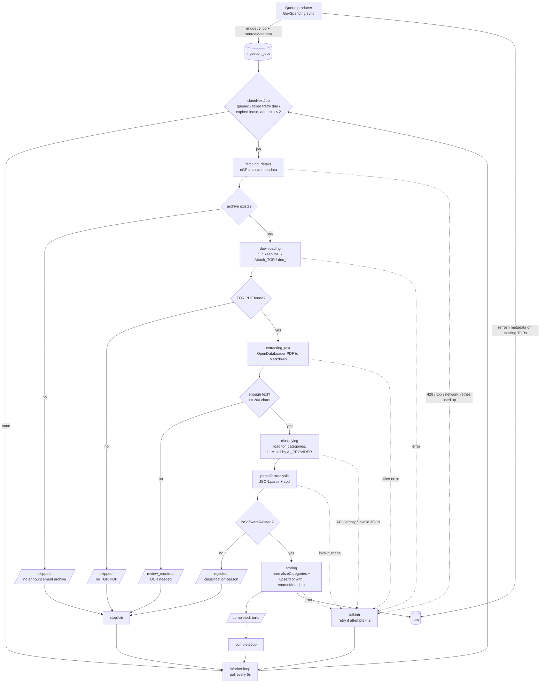
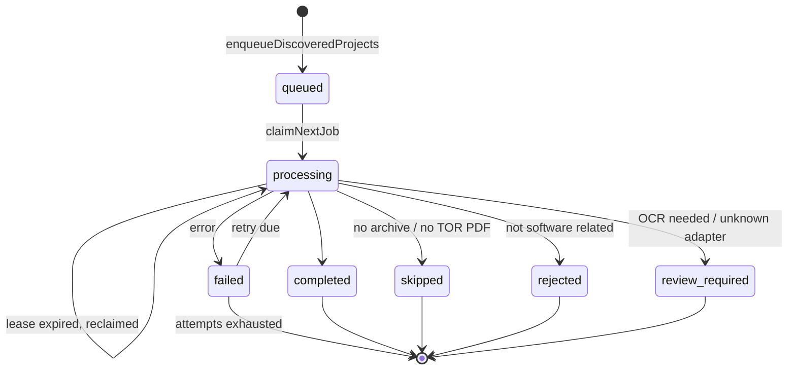
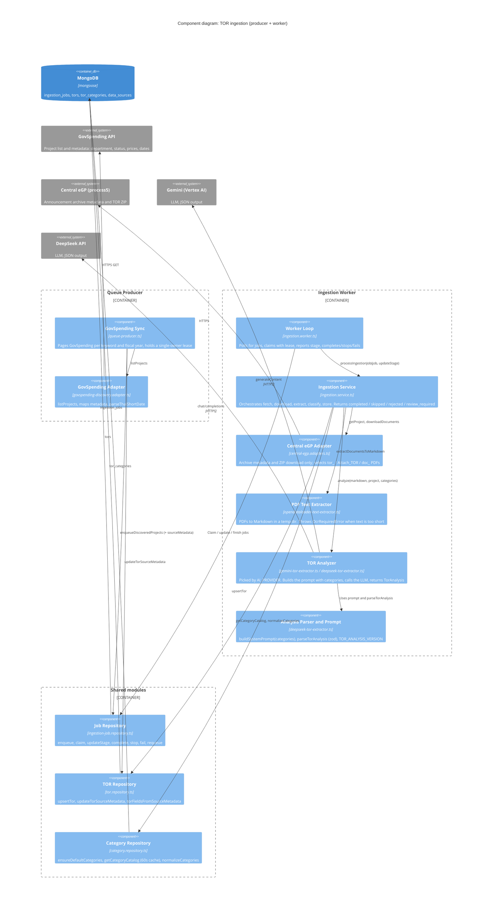

# TOR ingestion pipeline: workflow and C4 component view

Source: `app/backend/src/apps/queue-producer/`, `app/backend/src/apps/ingestion-worker/`, `app/backend/src/modules/ingestion/`, `app/backend/src/modules/category/`.

## Summary

Two processes share MongoDB:

- **Queue producer** calls GovSpending (`opend.data.go.th/govspending/service/egp-contract`) for each keyword and fiscal year. It does three things with each project:
  - enqueues an ingestion job, which is idempotent per `{dataSourceId, externalId, sourceVersion}`;
  - saves the project metadata on the job as `sourceMetadata`, refreshed on every sync;
  - refreshes those fields on TORs that already exist, with no LLM call.
- **BMA discovery** runs in the same producer when `BMA_SYNC_ENABLED` is on, which is the default. It searches `egp2.bangkok.go.th` (`GetProjectFromFilter`) for each keyword in `BMA_KEYWORDS`, sent as `projectSearchText`. The keywords fall back to `GOVSPENDING_KEYWORDS`. For each budget year of `BMA_BUDGET_YEAR` (comma-separated, defaulting to the current and previous Thai fiscal years) it queries three announce-type stages — ร่างขอบเขตของงาน (TOR), ประกาศราคากลาง and ประกาศเชิญชวน (`BMA_ANNOUNCE_TYPES`) — across all procurement methods. The rows carry no stage field, so each project's `projectStatus` is taken from the stage it was found in; a project found in several stages keeps its most advanced stage.
  - BMA's `projectNumber` is the Central eGP project id. Jobs are queued under the `bma-egp` data source with `sourceAdapter: 'bma_egp'`, and the worker processes them with the Central eGP adapter.
  - Metadata mapping: department is `masterOrgGroupName`, sub-department is `masterOrgDepartmentName`, budget is `projectBudget`, and status is the queried announce-type stage. The method is not known from the search, so `biddingMethod` is read later from the title/announcement.
  - BMA needs no API key. The producer starts if either source is configured.
- **Ingestion worker** polls for jobs, claims one at a time with a lease, and runs `processIngestionJob`:
  1. **Fetch archive metadata** from Central eGP (`process5.gprocurement.go.th`). If there is no announcement archive (`data: null`, code `E0001`), the job becomes `skipped`.
  2. **Download** the announcement ZIP and keep only the TOR PDFs, in this order:
     - `tor_<projectId>_<uuid>.pdf`: the TOR itself.
     - `Attach_TOR_<n>.pdf`: TOR attachments.
     - `doc_<deptId>_<projectId>.pdf`: the invitation or bid document.

     `annoudoc_*.pdf` (the announcement) is ignored. If no TOR PDF is found, the job becomes `skipped`.
  3. **Extract text**: OpenDataLoader converts the PDFs to Markdown, in the order above, capped at 300k characters. If fewer than 200 meaningful characters come out, the PDF is probably scanned, so the job becomes `review_required` (`OcrRequiredError`).
  4. **Classify and extract**: the active categories are loaded from the `tor_categories` collection and inserted into the prompt. One LLM call returns JSON, which is validated with zod (`parseTorAnalysis`). The provider is Gemini on Vertex AI or DeepSeek, chosen by `AI_PROVIDER`. The prompt treats the document as untrusted.
  5. **Gate**: if `isSoftwareRelated` is false, the job becomes `rejected`.
  6. **Store**: the TOR is upserted and the job becomes `completed`. The fields come from these sources:
     - LLM fields: summary, requirements, qualifications, technologies and categories.
     - GovSpending fields, taken from `job.sourceMetadata`: department, status, fiscal year, announce date and prices.

**Errors.** Any other thrown error calls `failJob`, and the job is retried with backoff. Retries follow these rules:
- A job gets at most 2 attempts (`MAX_ATTEMPTS`).
- The lease lasts 5 minutes and is renewed at each stage, so a crashed worker's job is reclaimed.
- Central eGP requests are spaced 1.2s apart in each process. HTTP 429, 5xx and network errors are retried inside the adapter.

## Where each TOR field comes from

| TOR field | Source |
|---|---|
| `departmentName`, `departmentSubName` | GovSpending `dept_name`, `dept_sub_name` |
| `projectStatus` | GovSpending `project_status` |
| `fiscalYear` | GovSpending `year` (Buddhist era, for example 2568) |
| `biddingMethod` | Regex (`modules/ingestion/bidding-method.ts`) on the eGP announcement PDF (`ด้วยวิธี…`), then the project title, then source metadata. Known methods are normalized, e.g. `ประกวดราคาอิเล็กทรอนิกส์ (e-bidding)`. |
| `announceDate` | GovSpending `announce_date` ("19 มิ.ย. 68" is parsed to a Date; `"-"` gives null) |
| `budgetBaht` | GovSpending `project_money`, falling back to the LLM value when null |
| `midPriceBaht` (reference price) | GovSpending `price_build` |
| `awardedPriceBaht` | GovSpending `sum_price_agree` |
| `projectTitle`, `agencyName` | LLM, falling back to the GovSpending `project_name` |
| `summary`, `objectives`, `requirements`, `bidderQualifications`, `technologies`, `contactInformation` | LLM |
| `submissionDeadline` (raw text), `submissionDeadlineAt` (Date) | LLM text, parsed by `parseThaiDate` (`modules/ingestion/thai-date.ts`). The date is null when no exact day is stated, for example "มกราคม 2569". The API returns `submissionDeadline` as `YYYY-MM-DD` or null, and the raw text as `submissionDeadlineText`. |
| `category`, `categories[]` | LLM, limited to active keys in `tor_categories` |
| `documents[]` | Names and URLs of the PDFs that were extracted |

GovSpending values that are null never overwrite a value already stored on a TOR. Central eGP's token and project-detail endpoints are not called during ingestion. `getProjectDetails` is kept only for `npm run backfill:egp-details`.

## TOR categories

Categories live in MongoDB (`tor_categories`) so that a future admin menu can manage them. Each row has these fields:
- `key`: stable and immutable. It is stored on TORs.
- `name`, `description`
- `aiHint`: extra guidance for the classifier.
- `order`, `active`

The 8 defaults are inserted on API and worker start, or with `npm run seed:categories`. Rows that already exist are never overwritten.

| key | name | description |
|---|---|---|
| web | Web Application | ระบบเว็บแอปพลิเคชันและพอร์ทัลบริการประชาชน |
| data | Data / BI | ระบบข้อมูล วิเคราะห์ และแดชบอร์ดผู้บริหาร |
| mobile | Mobile App | แอปพลิเคชันบนมือถือ iOS และ Android |
| enterprise | Enterprise System | ระบบสารสนเทศองค์กรและงานหลังบ้าน |
| consulting | Consulting / Architecture | งานที่ปรึกษาและออกแบบสถาปัตยกรรมระบบ |
| cybersecurity | Cybersecurity | ความมั่นคงปลอดภัยไซเบอร์และการตรวจสอบระบบ |
| ai | AI & Machine Learning | ปัญญาประดิษฐ์ การวิเคราะห์ขั้นสูงและระบบอัตโนมัติ |
| cloud | Cloud & Infrastructure | โครงสร้างพื้นฐาน คลาวด์ และระบบเครือข่าย |

The keys match the user interest ids on the profile page.

**Classifier output.** The classifier returns `primaryCategory` and `categories`. `normalizeCategories` then cleans them up:
- Unknown keys are dropped.
- If the primary is invalid, the first valid key is used.
- The primary is always stored first in `categories`.

**Display.** The TOR list, homepage analytics and reports use `resolveTorCategory`, which returns the stored `category`. TORs analysed before categories existed (analysis version below `v3`) fall back to the keyword guess in `deriveCategory` until they are reprocessed.

## Workflow diagram

### Job status transitions

`requeue:jobs` can move any terminal status back to `queued` (see Operations).

## C4 component diagram

## Operations

Run all commands from `app/backend`.

| Command | What it does |
|---|---|
| `npm run dev:producer` | Runs the GovSpending sync loop. One sync fills `sourceMetadata` on all jobs and refreshes existing TORs. |
| `npm run dev:ingestion` | Runs the ingestion worker. Several instances can run at once, because claims are lease-based. |
| `npm run seed:categories` | Inserts any missing default categories. |
| `npm run report:job-failures` | Read-only: job counts by status and stage, plus the most common error messages. |
| `npm run requeue:jobs -- [--dry-run] [--status=failed,rejected]` | Resets finished jobs to `queued` so the worker reprocesses them. Jobs held by a live lease are skipped. Each reprocessed job costs one eGP download and one LLM call. |
| `npm run backfill:deadlines -- [--dry-run]` | Parses the stored deadline text into `submissionDeadlineAt` on existing TORs. No LLM calls. |
| `npm run backfill:bidding-method -- [--dry-run] [--fetch-announcement]` | Fills `biddingMethod` on existing TORs from the project title; `--fetch-announcement` reads the eGP announcement PDF for the rest. No LLM calls. |
| `npm run backfill:egp-details` | Legacy: fills department and prices on TORs from the eGP detail endpoints. |

HTTP endpoints (API server):

| Endpoint | What it returns |
|---|---|
| `GET /api/v1/ingestion/report` | An HTML pipeline diagram built from the live job counts, refreshed every 30s. Add `?format=json` for the raw numbers. |
| `GET /api/v1/categories` | The active TOR categories in display order. |

## Known issues

- `parseTorAnalysis` error messages say "DeepSeek" even when the output came from Gemini.
- The `extracting_fields` stage does no work. Extraction already happens during `classifying`.
- The job field is spelled `attempCount` in the model.
- TORs processed before analysis version `v3` have no stored category or `doc_` documents until they are requeued.
- `/api/v1/ingestion/report` and `/api/v1/categories` do not require login. They expose counts and category names only.
